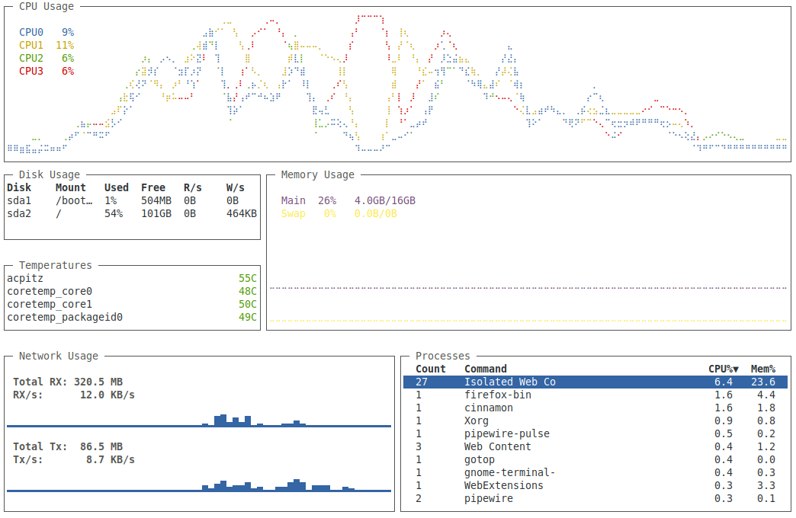

# Laita gotop Color Scheme



A custom color scheme for [gotop](https://github.com/cjbassi/gotop), meticulously designed for white-background terminals. This theme ensures optimal readability and a sleek look by using dark, contrasting colors against a light backdrop. Perfect for users who prefer a bright terminal environment.

## ✨ Features

* **Optimized for White Backgrounds**: Ensures excellent contrast and readability.
* **Clear Visuals**: Dark text and elements stand out cleanly on a light terminal.
* **Minimalist Design**: A clean and uncluttered look for your system monitoring.

## 🚀 Installation

Follow these simple steps to install and apply the `Laita` color scheme for `gotop`.

### 1. Download the Theme File

You can download the `laita.json` file directly from this repository or clone the repository:

**Option A: Download Manually**
Click on the `laita.json` file above, then click the "Raw" button, and save the content.

**Option B: Clone the Repository**
```bash
git clone https://github.com/r8thlon/laita-gotop-color-scheme.git
cd laita-gotop-color-scheme/gotop
```

### 2. Place the Theme File

gotop looks for custom themes in a specific directory. Copy the downloaded laita.json file to ~/.config/gotop/:

```bash
mkdir -p ~/.config/gotop/ # Create the directory if it doesn't exist
cp ./laita.json ~/.config/gotop/
```
(If you cloned the repo, make sure you are in the laita-gotop-color-scheme directory when running cp)

### 3. Apply the Theme

Now you can run gotop and specify the Laita theme using the -c flag:

```bash
gotop -c laita
```

### 🤝 Contributing

If you have suggestions or improvements, feel free to open an issue or submit a pull request!

### 📄 License

This project is licensed under the MIT License - see the LICENSE file for details.
